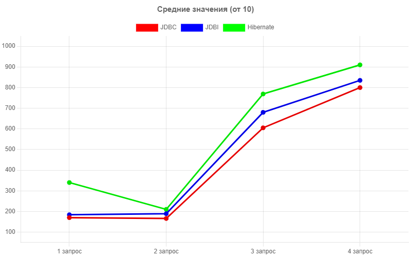

# Лабораторная работа по базам данных №3

Бенчмарк полностью написан на Java
- JDBC (Native SQL queries)
- Spring JDBC (Native SQL queries)
- Hibernate (ORM)

## Запуск бенчмарка

(1) Клонируем репозиторий командой:
```
git clone https://github.com/Mr-Darkson/DBLab3.git
```

(2) Для работы бд понадобится docker image, который можно скачать по ссылке: https://hub.docker.com/repository/docker/ilyasekunov/preloaded_db/general. Немного повзаимствовали.
```
docker pull ilyasekunov/preloaded_db
```

(3) Далее запускаем контейнер командой:
```
docker container run -d -p 5432:5432 -e POSTGRES_PASSWORD=postgres -e POSTGRES_USER=postgres --name db ilyasekunov/preloaded_db:latest
```

(4) Далее в корневой папке проекта запускаем приложение командой:
```
mvn exec:java -Dexec.mainClass="cme/absolute/springcourse/App"
```

Чтобы конфигурировать бенчмарк в папке с проектов должен быть файл <b>config.json</b> в <b>src/main/resources</b>:
```json
// config.json
{
    "tests-count": , // количество тестов на каждую библиотеку и запрос.
    "libraries": [ // библиотеки для теста
        {
            "name": , // имя библиотеки
        }
        ...
    ]
}
```
Доступны следующие имена библиотек:
1) JDBC
2) JDBI
3) Hibernate

Программа будет отрабатывать только те названия в JSON, которые соответствуют одной из библиотек.

## Результаты



Как мы можем видеть - JDBC и JDBI немного выигрывают в скорости запросов. В целом, эта разница невелика. Ну разве что на 1 тесте скорость действительно отличается практически в 2 раза.


## JDBC

Работа с самым низкоуровневым API для SQL приносит некоторые неудобства - ручной контроль соединений с базой данных (установление, закрытие), необходимость ручного парсинга результатов запроса. Это все может привести к непридвиденным багам (небезопасно). Данные минусы очень сильно заметны особенно при масштабировании приложения. Поэтому данный способ практически никто уже не использует отдельно в крупных проектах.

Однако низкоуровневость позволяет более гибкую конфигурацию и скорость выполнения запросов (особенно это заметно на 1-м запросе).

## Spring JDBC

Web-фреймворк Spring предоставляет тонкую надстройку над обычным JDBC. Теперь не нужно саморучно контролировать соединения с БД (Spring предоставляет потокобезопасное использование и переиспользование соединений); Spring предоставляет новый API для работы с БД, упрощающий запросы и предотвращающий возможность SQL-инъекций. Помимо этого это все еще является низкоуровневым способом для работы с БД, что все еще не очень удобно в использовании.

В то же время скорость работы в среднем данного решения будет медленнее обыкновенного JDBC, но быстрее ORM-аналогов.

## Hibernate

Наиболее популярный ORM-фреймворк для Java предоставляет реализацию стандартов JPA (Java Persistence API). На ступень выше уровень абстракции позволяет пользователю (посредством аннотация и XML конфигураций) связывать сущности (entity) с реальными SQL таблицами. Помимо этого Hibernate предоставляет автоматическое и гибко конфигурируемое управление транзакциями. Более высокий уровень абстракции позволяет заметно сократить количество кода, что уже очень удобно.

Однако за облегчение использования приходится платить скоростью запросов. Заметно становится на 1-м запросе, на остальных разница минимальна (возможно не очень удачные запросы для того, чтобы заметить разницу).


## А что выбирать?
JDBC и JDBI очевидно достаточно быстрые, так как являются низкоуровневыми библиотеками. Hibernate же намного удобнее в работе. Не смотря на меньшую скорость обработки запросов - значительно упрощает написание кода.
